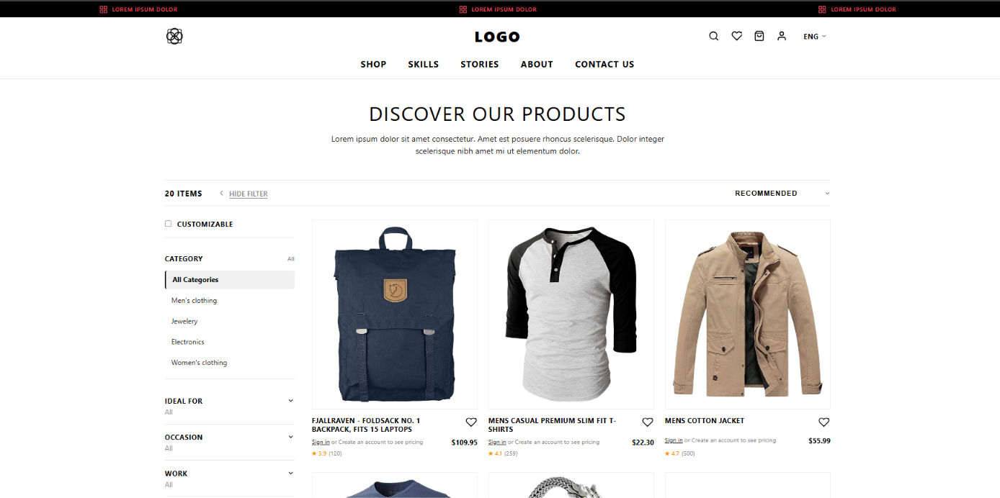
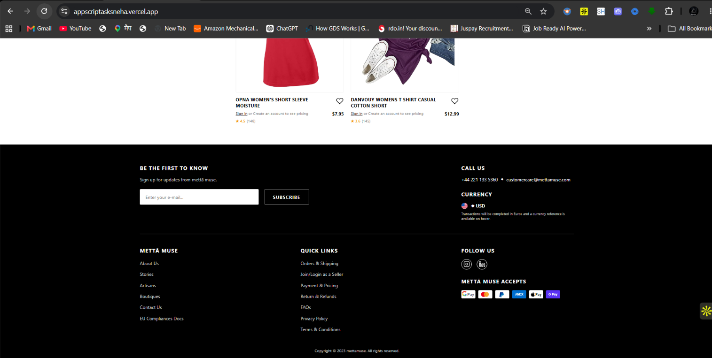
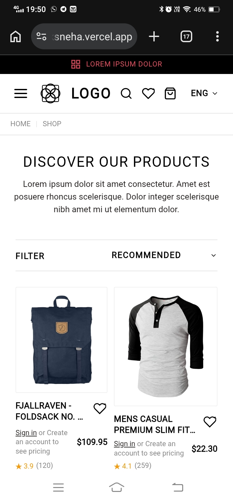
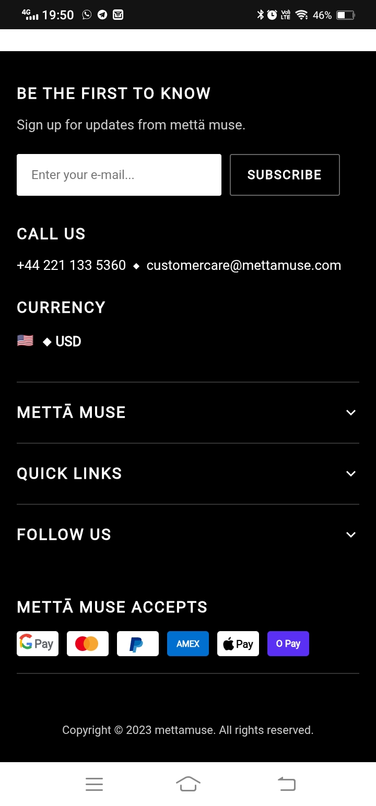

# Appscrip Frontend Assignment — Product Listing Page (PLP)

Hi! I'm **Sneha**, and this is my solution for the **Appscrip Frontend Development Assignment**. 

I built this Product Listing Page (PLP) using **Next.js (App Router)**, **React**, **TypeScript**, and **CSS**. The application is fully server-rendered (SSR), responsive across all screen sizes, and optimized for SEO and web performance without using any external UI frameworks or third-party component libraries.

---

##  Tech Stack

* **Framework**: Next.js 16 (App Router)
* **Language**: TypeScript
* **Styling**: Plain Vanilla CSS
* **API**: Fake Store API

---

##  How to Run Locally

1. **Clone the repository**:
   ```bash
   git clone <repository-url>
   cd plp
   ```

2. **Install dependencies**:
   ```bash
   npm install
   ```

3. **Start the development server**:
   ```bash
   npm run dev
   ```
   Open [http://localhost:3000](http://localhost:3000) in your browser.

4. **Build for production**:
   ```bash
   npm run build
   npm run start
   ```

##  Application Screenshots

### Desktop View





### Mobile View

<p align="center">
  
  &nbsp;
  
</p>

---

*Submitted by **Sneha** for the Appscrip Frontend Assignment.*

